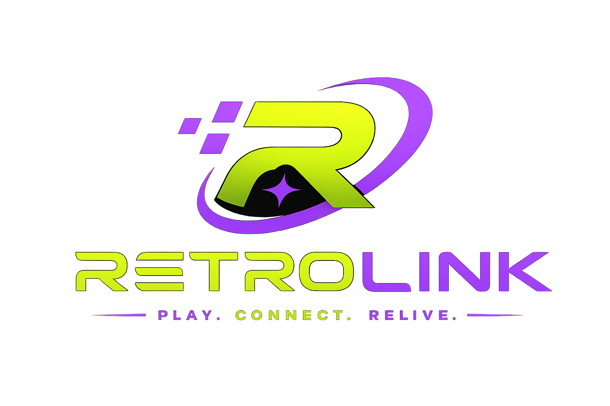
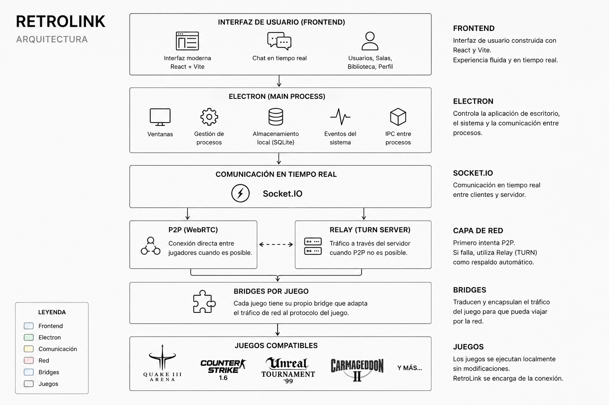
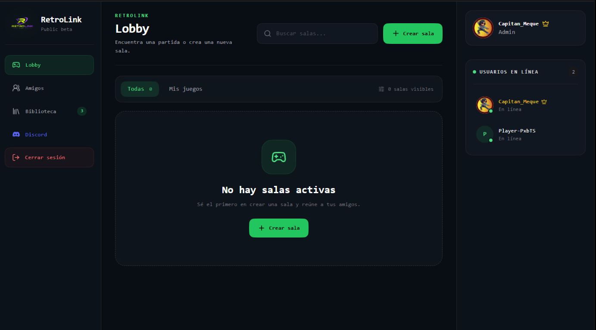
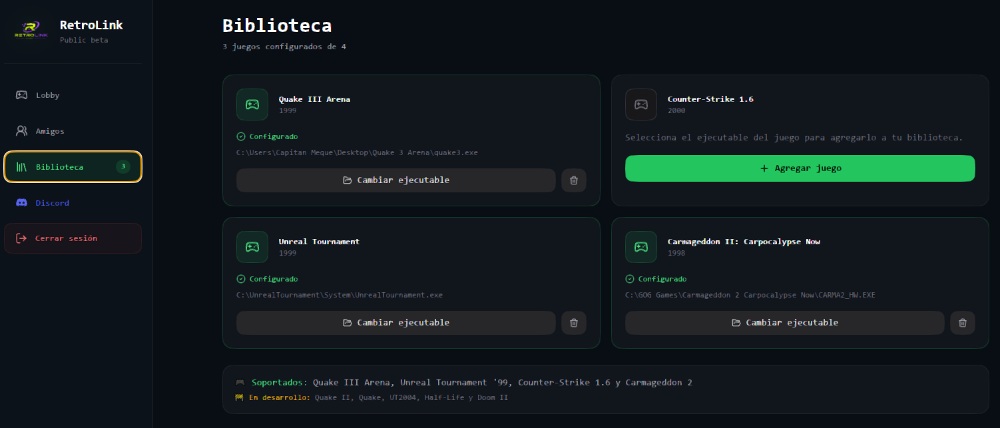
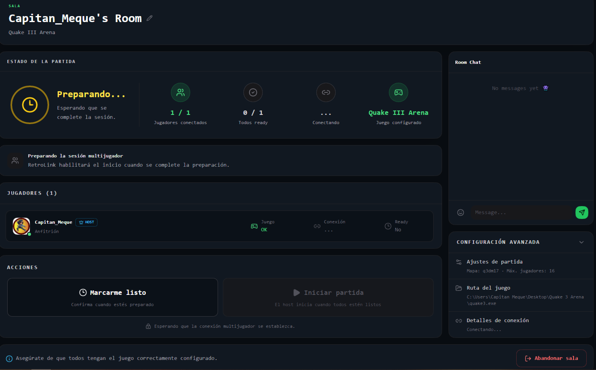

  

<h1 align="center">RetroLink</h1>

<b>Reviviendo los clásicos, juntos.</b>

---

# 🎮 ¿Qué es RetroLink?

RetroLink es una plataforma que permite volver a jugar títulos clásicos de PC en línea mediante un sistema moderno de salas, conexiones **P2P** y **Relay**.

El objetivo del proyecto es eliminar configuraciones complicadas, redes VPN y modificaciones innecesarias, haciendo que crear una partida sea tan simple como abrir RetroLink, invitar a un amigo y jugar.

---

# Arquitectura

RetroLink utiliza una arquitectura modular basada en Electron, React y Socket.IO.

Cada juego posee un **bridge independiente** encargado de adaptar el protocolo de red original al sistema de comunicación de RetroLink, permitiendo agregar nuevos juegos sin modificar el motor principal.

---

# Características

- 🎮 Biblioteca de juegos
- 👤 Sistema de cuentas
- 🖼️ Perfil con avatar
- 💬 Chat integrado
- 🌐 Conexión P2P automática
- 🔄 Relay automático cuando P2P no es posible
- 🚀 Lanzamiento automático de juegos
- ⚙️ Configuración individual por juego
- 🔌 Arquitectura modular para nuevos bridges

---

# Juegos compatibles

| Juego | Estado |
|--------|--------|
| ✅ Quake III Arena | Compatible |
| ✅ Counter-Strike 1.6 | Compatible |
| ✅ Unreal Tournament '99 | Compatible |
| 🟡 Carmageddon II | Experimental |

---

# Próximamente

Se encuentran planificados para futuras versiones:

- Dawn of War
- Age of Mythology
- Star Wars Galactic Battlegrounds

---

# Capturas

## Lobby

---

## Biblioteca

---

## Sala

---

## Relay

---

# Instalación

1. Descarga la última versión desde **Releases**.
2. Ejecuta el instalador.
3. Inicia sesión.
4. Configura la ruta de tus juegos.
5. Crea una sala.
6. ¡Disfruta!

---

# Requisitos

- Windows 10 o Windows 11
- Conexión a Internet
- Copia legal de los juegos compatibles
- La misma versión del juego entre todos los participantes

---

# Roadmap

## Completado

- [x] Sistema de cuentas
- [x] Biblioteca
- [x] Chat
- [x] Salas
- [x] P2P
- [x] Relay automático
- [x] Quake III Arena
- [x] Counter-Strike 1.6
- [x] Unreal Tournament '99'

## En desarrollo

- [ ] Carmageddon II
- [ ] Lista de amigos
- [ ] Overlay
- [ ] Actualizador automático

## Futuro

- [ ] Más RTS clásicos
- [ ] Más juegos LAN
- [ ] Estadísticas
- [ ] Perfil público
- [ ] API para nuevos bridges

---

# Contribuciones

Las sugerencias y reportes de errores siempre son bienvenidos.

Puedes colaborar mediante:

- Issues
- Pull Requests
- Reportes de bugs
- Nuevos bridges para juegos

---

# Reportar un problema

Si encuentras un error intenta incluir:

- Juego utilizado
- Versión de RetroLink
- Host o Cliente
- Tipo de conexión (P2P o Relay)
- Capturas de pantalla
- Logs

Esto facilita enormemente la resolución del problema.

---

# Comunidad

### Discord

https://discord.gg/rSERkhBgU2

En Discord podrás:

- Buscar jugadores
- Reportar errores
- Compartir sugerencias
- Seguir el desarrollo del proyecto

---

# Licencia

RetroLink distribuye únicamente su propio software.

Los juegos compatibles pertenecen a sus respectivos propietarios y deben adquirirse legalmente.

---

# Agradecimientos

Gracias a todas las personas que han participado en las pruebas de RetroLink.

Cada reporte de errores y cada prueba de conexión ha ayudado a mejorar el proyecto.

---

## Reviviendo los clásicos, juntos.

